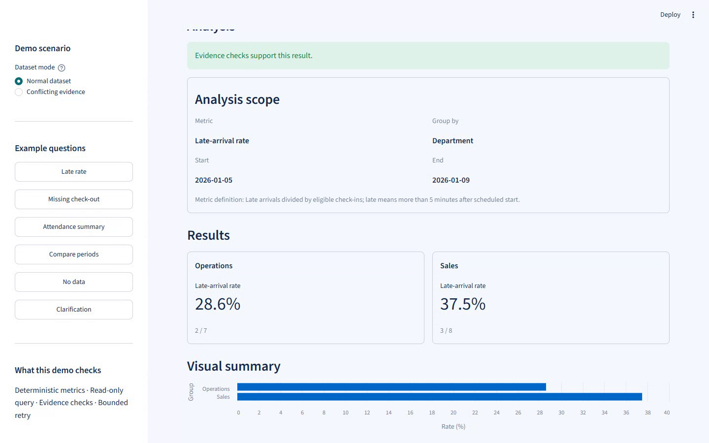
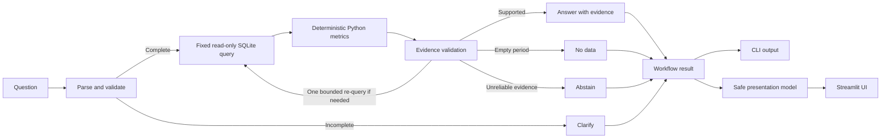

# Self-Correcting Attendance Analyst

An evidence-grounded attendance analytics **prototype**. It answers a bounded set of operations questions with deterministic metrics, checks the supporting data, and withholds a result when the evidence is unreliable.

**Watch the 2:17 demo with the user's narration:** [Four real workflow outcomes](portfolio/demo_walkthrough_user_voice.mp4) · [Run locally](#run-locally) · [Read the test report](TEST_REPORT.md)

Python · LangGraph · SQLite · Streamlit · Pytest · Synthetic data · No API key required



## Business problem and solution

Attendance reports can be misleading when the question omits a period, the selected dates have no rows, records conflict, or a rate has no valid denominator. A plausible number is not enough; the analyst must show which data supports it and when it cannot answer.

This prototype validates the request, runs fixed read-only SQL against a synthetic attendance fixture, calculates metrics in Python, and checks the evidence before returning **answered**, **clarification**, **no data**, or **abstained**. In this project, *self-correcting* means bounded evidence validation and at most one evidence re-query under defined conditions. It does not mean autonomous data repair or unrestricted LLM reasoning.

## Four demo outcomes

| Outcome | Try it | What the real workflow returns |
| --- | --- | --- |
| **Supported answer** | “What was the late rate by department from 2026-01-05 to 2026-01-09?” | Operations **2/7 = 28.6%**; Sales **3/8 = 37.5%**, with period, definition, evidence ID, and data caveats. |
| **Two-period comparison** | “Compare late rates by department from 2026-01-05 to 2026-01-05 versus 2026-01-06 to 2026-01-09” | Operations **50.0% → 20.0% (−30.0 pp)**; Sales **50.0% → 33.3% (−16.7 pp)**. The one-day and four-day periods are labeled. |
| **Clarification** | “What was the late rate by department?” | Requests the missing reporting period; no query or guessed metric result. |
| **Abstention** | Select **Conflicting evidence** in the UI, then analyze the late-rate example; or run `demo\abstain_demo.py`. | A controlled synthetic row conflicts with an existing source ID; evidence validation withholds the result. |

The UI also includes a **No data** example. It describes an empty result in the selected synthetic fixture without claiming no real attendance event occurred.

The video uses the running local UI and the project's synthetic conflict fixture. The [voice edit notes](portfolio/VIDEO_SCRIPT.md) record the four source files and scene timing.

## What makes it different

1. **Deterministic metrics.** Business rules in Python calculate the counts, rates, and percentage-point changes; no LLM generates the figures.
2. **Evidence validation.** The workflow checks dates, row coverage, duplicate/conflicting source IDs, denominator availability, and query/result consistency before supporting a result.
3. **Safe failure.** The workflow can answer, ask for a missing detail, report no matching fixture rows, or abstain. Conflicting evidence does not become a confident answer.

## How it works



LangGraph coordinates the workflow. SQLite reads are fixed, parameterized `SELECT` statements against synthetic data. The Streamlit UI renders a safe result view, including charts and the completed workflow path, without recalculating metrics or exposing raw rows. For the exact graph, metric definitions, comparison semantics, query bounds, and SQL safeguards, see [WORKFLOW.md](WORKFLOW.md), [PROJECT_BRIEF.md](PROJECT_BRIEF.md), and [ACCEPTANCE.md](ACCEPTANCE.md).

## Run locally

From this project folder in **Windows PowerShell**, with Python 3.11 available as `py -3.11`:

```powershell
py -3.11 -m venv .venv
.\.venv\Scripts\python.exe -m pip install -e ".[dev,ui]"
.\.venv\Scripts\python.exe -m attendance_analyst --question "What was the late rate by department from 2026-01-05 to 2026-01-09?"
.\.venv\Scripts\python.exe -m streamlit run ui\app.py
```

Open the local URL shown by Streamlit. Use the sidebar's **Example questions** buttons for supported, comparison, clarification, and no-data requests. For abstention, choose **Conflicting evidence** under **Dataset mode**, choose **Late rate**, and click **Analyze**. Stop the server with `Ctrl+C`.

To run the checks and the standalone conflict demo:

```powershell
.\.venv\Scripts\python.exe -m pytest
.\.venv\Scripts\python.exe demo\abstain_demo.py
```

The full set of supported question forms and verification results are in [PROJECT_BRIEF.md](PROJECT_BRIEF.md) and [TEST_REPORT.md](TEST_REPORT.md). The UI and CLI use only synthetic data and need no production credentials.

## Scope and limitations

**Implemented:** a bounded English/Vietnamese intent parser; single-period and two-period attendance metrics; deterministic calculations; fixed read-only queries; evidence checks with at most one controlled re-query; clarification, no-data, and abstention paths; a local Streamlit demo.

**Not implemented:** a production Wise Eye connector, verified company HR policies, unrestricted natural-language analytics, autonomous data correction, production authentication/security, or persistent production deployment. The fixture, five-minute late grace period, and metric denominators are demo assumptions. Validate real schema, business rules, timezone, security needs, and operating environment before applying this pattern to live data. The prototype makes no employment decisions.
