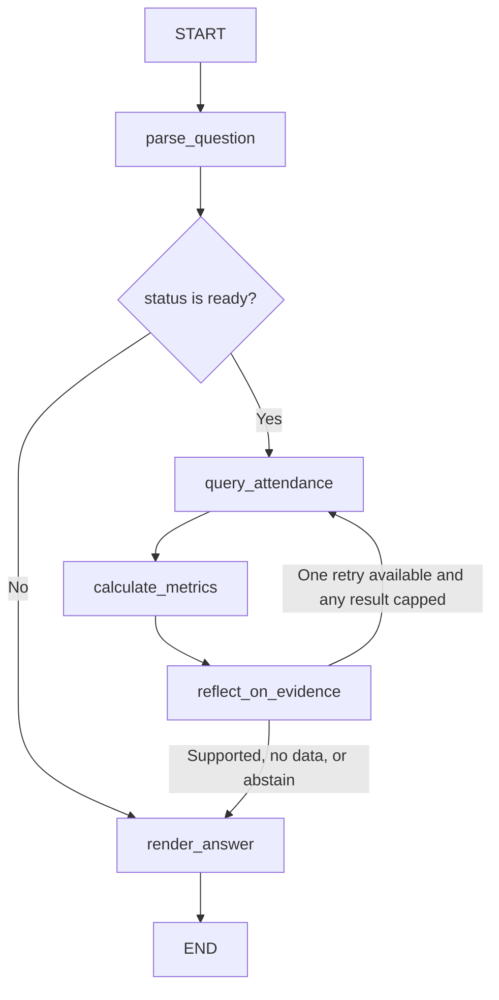

# Module 2 workflow

## State graph

## Graph state and routing

The graph uses a typed `AnalystState` (`src/attendance_analyst/graph.py`). Each node returns only the fields it updates; LangGraph merges them into the state.

## Streamlit presentation layer

`ui/app.py` calls `run_question(question)` and renders the returned structured state through `ui/presentation.py`. It stores the question and safe view model in `st.session_state`, so reruns retain the last result; selecting a different example or demo scenario clears that result. The conflict scenario and standalone abstention demo share one synthetic fixture builder. The UI does not invoke `graph.invoke()` or recalculate metrics. `to_safe_view` copies an explicit allowlist of request fields, canonical metric definitions from the graph module, deterministic results, evidence metadata, retry counts, and quality counts; it excludes source rows, query text/parameters, and the full graph state. It also shapes engine-calculated `rate_pct`, `count`, and deltas into a chart view model. The adapter does not compute rates or changes; `app.py` renders those values with Streamlit native charts. A denominator-zero rate remains unavailable and is omitted from plotted bars. Evidence issue details map to fixed safe messages instead of displaying arbitrary issue text. Status-specific renderers distinguish answered, clarification, no-data, abstained, and unsupported outcomes; non-answered outcomes have no chart. Comparisons use a separate table and label rate changes in percentage points.

The UI shows the question, outcome status, exact results, chart, and a safe evidence snapshot in that order. Comparison chart metadata names the two date ranges; its delta table follows the bars so it remains readable at narrow widths. The light Streamlit theme is configured in `.streamlit/config.toml`. All controls retain native labels and keyboard behavior.

### Completed workflow path
The safe presentation adapter builds a workflow_path only when the terminal status and final_status are consistent. It uses the parsed request, execution_count, evidence_retry_count, query-error presence, and calculation evidence. It never copies exception text or query internals into the path. Supported, no-data, and abstained requests must show at least one actual query pass; clarification and unsupported questions show the query, calculation, and evidence steps as not run. A calculation is considered to have run when the engine analysis contains its metric marker. This includes empty-row analyses in the no-data path. A query failure skips metric calculation. A retry step is shown only when evidence_retry_count records the bounded retry. Streamlit presents the completed path as a numbered text list with explicit states inside a collapsed section.

Streamlit is an optional package extra (`.[ui]`); installing or running the CLI does not require it. Usage statistics collection is disabled in `.streamlit/config.toml` for this local synthetic demo.

| State fields | Purpose |
| --- | --- |
| `question`, `source_records`, `source_name` | User question and synthetic input provenance. |
| `request`, `status`, `message` | Validated metric, either one inclusive date range or two comparison periods, optional grouping, or a clarification/unsupported reason. |
| `records`, `period_records`, `query`, `query_parameters`, `query_id`, `query_limit`, `query_truncated`, `query_error` | Read-only query evidence and its bounded-result metadata. A comparison keeps each period's rows separate. |
| `execution_count`, `sql_statement_count`, `evidence_retry_count` | `execution_count` counts graph query-node passes. A comparison uses two SELECT statements per pass; the retry bound applies to the pair. |
| `analysis`, `reflection_issues`, `final_status` | Deterministic calculations and evidence-check outcome (`supported`, `no_data`, `retry`, or `abstain`). |
| `answer` | User-facing result or clarification. |

Implemented node names and edges:

- `START → parse_question`.
- Conditional route from `parse_question`: `status == ready → query_attendance`; otherwise `render_answer`.
- `query_attendance → calculate_metrics → reflect_on_evidence`.
- Conditional route from `reflect_on_evidence`: `final_status == retry → query_attendance`; all other outcomes go to `render_answer`.
- `render_answer → END`.

The retry query uses a one-row look-ahead: exactly reaching a configured limit is complete, while an additional row proves truncation. For a comparison, the fixed parameterized read-only SELECT runs separately for each date range and applies the same per-period row cap. If either period is truncated, one larger retry rereads both periods; a still-truncated result abstains. Thus a comparison runs two SELECTs initially and at most two more on retry.

Comparison periods must be explicit, inclusive ISO date ranges in chronological order, with no overlap. The same metric and grouping are applied to both periods. Unequal durations are allowed and shown. Count deltas are raw total differences, while rate deltas are percentage points. If either whole period has no rows, the comparison is withheld; a missing subgroup in an otherwise populated period has count zero, while its rate and rate delta remain unavailable at denominator zero.

## Project-agent workflow
This is the Codex execution workflow used to build and maintain the Module 2 app:

1. **Coordinator / main chat:** reads the brief and acceptance criteria; identifies current state and owns the plan, gates, retries, and final handoff.
2. **Discovery (parallel, read-only):** when useful, delegate separate questions such as “inspect available attendance assets/schema” and “draft edge-case evaluation cases.” Each agent reports findings, evidence/paths, assumptions, and unresolved questions. No shared-file edits in this phase.
3. **Implementation:** one owner edits the app for the current milestone. Split implementation only when file ownership is non-overlapping and interfaces are agreed.
4. **Review:** an independent reviewer checks the diff against `ACCEPTANCE.md`, focusing on query safety, data correctness, evidence grounding, and scope. Reviewer reports findings before making any edits.
5. **Test:** tester runs the defined unit, query-safety, graph-path, and evaluation checks; records exact commands and observed results.
6. **Repair loop:** route each concrete finding to the implementation owner. Re-run affected review/tests; also run the full relevant suite before handoff.
7. **Handoff:** coordinator updates `STATUS.md` and `TEST_REPORT.md`, then reports deliverables, run command, verified checks, limitations, and next task.

## Gates and branches
- `INTAKE -> DISCOVERY`: objective, supported questions, deliverables, and acceptance checks are written down.
- `DISCOVERY -> IMPLEMENT`: schema assumptions and existing assets have been inspected; unsupported assumptions are marked.
- `IMPLEMENT -> REVIEW`: a runnable vertical slice exists or a blocker is documented.
- `REVIEW -> TEST`: no unresolved high-impact review finding remains.
- `TEST -> REPAIR`: one or more checks fail; return the observed failure to the implementation owner.
- `TEST -> HANDOFF`: required checks pass, or the precise external blocker and unverified items are stated.
- Missing business definitions go to `NEED_USER_INPUT`; routine stack choices can be decided and recorded by the coordinator.

Do not loop indefinitely. If the same blocker repeats or a required external input is unavailable, stop that branch, preserve the partial work, and report exactly what is needed.
